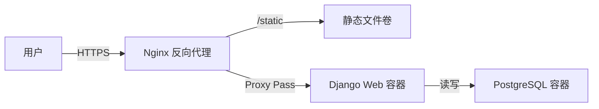

# HRMS 系统测试与部署报告

## 1. 测试概况

本项目采用 **Jenkins Pipeline** 驱动的自动化测试流程，结合 **Pytest** 框架进行单元测试与集成测试，确保代码质量与功能稳定性。

### 1.1 测试范围
测试覆盖了系统的核心业务模块与关键路径，具体包括：

- **核心模块 (Core)**
  - **认证测试**：覆盖登录页面渲染、账号密码验证、登录成功跳转、未登录拦截重定向。
  - **仪表盘测试**：验证不同角色（超级管理员 vs 普通员工）看到的仪表盘数据差异（如管理员概览 vs 个人考勤/请假信息）。
- **员工管理 (Employee)**
  - **模型测试**：验证员工档案创建、工号唯一性、关联组织结构及 `__str__` 展示逻辑。
- **组织架构 (Organization)**
  - **层级测试**：验证父子组织关系关联、部门负责人绑定逻辑。
- **请假管理 (Leave)**
  - **申请流程**：测试请假单创建、状态流转（审核中/已批准）。
  - **时间段拆分**：验证请假时间段（LeaveTimeSegment）的自动拆分与关联逻辑，确保 UUID 关联正确。
- **绩效管理 (Performance)**
  - **评分规则**：测试自动评分逻辑（出勤率/请假率计算）、权重加权公式、异常数据（如权重为0）的容错处理。
  - **边界条件**：验证满勤、全勤、缺勤等极端情况下的得分计算准确性。

### 1.2 测试工具与指标
- **框架**：Pytest + Django Test Client
- **覆盖率工具**：pytest-cov
- **代码规范**：Black (格式化检查), Bandit (安全扫描)
- **报告产出**：
  - JUnit XML 测试结果 (`test-results.xml`)
  - HTML 可视化测试报告 (`report.html`)
  - Cobertura 代码覆盖率报告 (`coverage.xml`)
  - HTML 覆盖率详情 (`htmlcov/`)

---

## 2. Jenkins 基础设施搭建与配置

本项目的 CI/CD 核心依赖于部署在 VPS 上的 Jenkins 服务。以下是详细的搭建与集成步骤。

### 2.1 Jenkins 在 VPS 上的部署
Jenkins 采用 Docker 容器化部署，确保环境隔离与易于升级。

1.  **Docker 环境准备**：
    - VPS 操作系统：Ubuntu 22.04 LTS (或其他 Linux 发行版)。
    - 安装 Docker Engine 与 Docker Compose。

2.  **Jenkins 容器启动**：
    使用 `docker-compose.yml` 启动 Jenkins LTS 版本。关键配置如下：
    - **端口映射**：`8080:8080` (Web UI), `50000:50000` (Agent 通信)。
    - **数据持久化**：挂载宿主机目录 `/srv/jenkins_home` 到容器 `/var/jenkins_home`，确保配置与构建历史不丢失。
    - **Docker in Docker (DinD)**：
      - 将宿主机的 Docker Socket (`/var/run/docker.sock`) 挂载进 Jenkins 容器。
      - **目的**：允许 Jenkins 内部调用宿主机的 Docker 引擎来构建镜像、启动测试数据库容器（即流水线中的 `docker compose` 命令实际是在宿主机上执行的）。

3.  **Nginx 反向代理**：
    - 配置 Nginx 监听域名（如 `jenkins.kohinbox.top`）。
    - 转发请求到 `localhost:8080`。
    - 配置 SSL 证书（Let's Encrypt）保证访问安全。

### 2.2 GitHub 集成配置
为了实现代码提交即触发构建，Jenkins 与 GitHub 进行了双向绑定。

1.  **GitHub Webhook**：
    - 在 GitHub 仓库设置中添加 Webhook。
    - **Payload URL**: `https://jenkins.kohinbox.top/github-webhook/`
    - **Content type**: `application/json`
    - **Events**: 勾选 "Pushes" 和 "Pull requests"。
    - **效果**：每当有代码推送到 GitHub，GitHub 会向 Jenkins 发送通知。

2.  **Jenkins 凭证管理**：
    - **GitHub Access Token**：用于 Jenkins 拉取私有仓库代码或回写构建状态（Commit Status）。
    - **SSH Deploy Key** (`vps-deploy-key`)：
      - 生成一对 SSH 密钥。
      - 公钥 (`id_rsa.pub`) 添加到 VPS 的 `~/.ssh/authorized_keys`。
      - 私钥 (`id_rsa`) 存入 Jenkins Credentials 系统。
      - **用途**：流水线 Deploy 阶段使用此私钥 SSH 登录 VPS 执行部署脚本。

### 2.3 流水线 (Pipeline) 构建逻辑
Jenkins 任务类型为 **Multibranch Pipeline**（多分支流水线），它自动扫描仓库中的 `Jenkinsfile`。

1.  **触发机制**：
    - 收到 Webhook -> Jenkins 扫描仓库 -> 发现 `Jenkinsfile` -> 启动构建。

2.  **CI 阶段 (持续集成)**：
    - **环境隔离**：利用 `docker compose -f ci/docker-compose.yml` 启动一套全新的、独立的测试环境（包含 Web 和 DB）。
    - **依赖安装**：在隔离环境中安装 `requirements.txt`。
    - **代码检查**：执行 Black 格式检查和 Bandit 安全扫描。
    - **自动化测试**：运行 Pytest。
    - **结果归档**：测试完成后，销毁 CI 环境容器，保留测试报告。

3.  **CD 阶段 (持续部署)**：
    - **条件判断**：仅当 CI 阶段全部通过，且当前分支为 `main` 时执行。
    - **部署执行**：
      - Jenkins 通过 SSH 连接到 VPS 宿主机。
      - 进入生产目录 `/srv/hrms`。
      - 拉取最新代码。
      - 重建生产容器 (`docker compose up -d --build`)。
      - 执行生产数据库迁移。

---

## 3. 自动化部署流程 (CI/CD)

项目使用 **Jenkins** 实现持续集成与持续部署，流水线定义在 `Jenkinsfile` 中，主要包含以下阶段：

### 2.1 构建与测试环境 (CI)
1. **Checkout**：拉取 GitHub 最新代码。
2. **Start Database**：使用 `docker compose` 在 CI 环境启动临时的 PostgreSQL 数据库容器。
3. **Install Dependencies**：将代码复制到 Web 容器并安装 `requirements.txt` 依赖。
4. **Migrate & Init**：执行数据库迁移、应用触发器/视图脚本 (`apply_triggers.py`, `apply_views.py`) 及初始化基础数据。
5. **Lint & Security**：
   - 运行 `black --check` 检查代码格式。
   - 运行 `bandit` 扫描潜在的安全漏洞。
6. **Test**：
   - 执行 `pytest`，生成测试报告与覆盖率报告。
   - 归档测试产物（XML/HTML），若测试失败则标记构建不稳定并终止部署。

### 2.2 生产环境部署 (CD)
当测试全部通过后，流水线自动执行部署阶段：

1. **凭证注入**：通过 Jenkins Credentials 注入 VPS 的 SSH 私钥。
2. **生成部署脚本**：动态生成 `deploy.sh`，包含以下步骤：
   - 进入服务器部署目录 `/srv/hrms`。
   - 拉取最新代码并重置到 `origin/main`。
   - 使用 `docker compose -f docker-compose.prod.yml` 拉取镜像并重建容器。
   - 执行数据库迁移与静态文件收集 (`collectstatic`)。
   - 执行健康检查。
3. **远程执行**：通过 `scp` 将脚本传送到 VPS 并通过 `ssh` 执行。

---

## 3. 生产环境架构与 Nginx 配合

生产环境采用 **Docker Compose** 编排，结合 **Nginx** 作为反向代理服务器。

### 3.1 容器架构
- **Web 服务**：基于 Django 的应用容器，运行在 8000 端口（仅对内暴露或映射到宿主机）。
- **Database**：PostgreSQL 16 容器，数据持久化挂载到 `prod_pgdata` 卷。
- **静态资源**：通过 Docker Volume (`static_volume`, `media_volume`) 共享给 Nginx。

### 3.2 Nginx 配置策略
Nginx 在宿主机（或独立容器）上运行，承担以下职责：

1. **反向代理**：
   - 监听 80/443 端口。
   - 将动态请求 (`/`, `/api`, `/admin`) 转发给 Django 容器 (`http://127.0.0.1:8000` 或 `http://web:8000`)。
   - 配置 `proxy_set_header` 传递 `Host`, `X-Real-IP` 等头信息，确保 Django 能正确获取客户端 IP。

2. **静态文件服务**：
   - 直接处理 `/static/` 和 `/media/` 请求。
   - 挂载 Docker 卷中的静态文件目录，由 Nginx 高效分发，无需经过 Django。

3. **SSL/TLS 终结**：
   - 配置 HTTPS 证书（如 Let's Encrypt），负责加密解密，后端 Django 仅处理 HTTP。

### 3.3 部署示意图

---

## 4. 总结
当前体系实现了从代码提交到自动测试、再到生产部署的全自动化闭环。测试覆盖了核心业务逻辑，部署流程包含安全检查与健康监测，结合 Nginx 动静分离架构，确保了系统的高可用性与可维护性。
