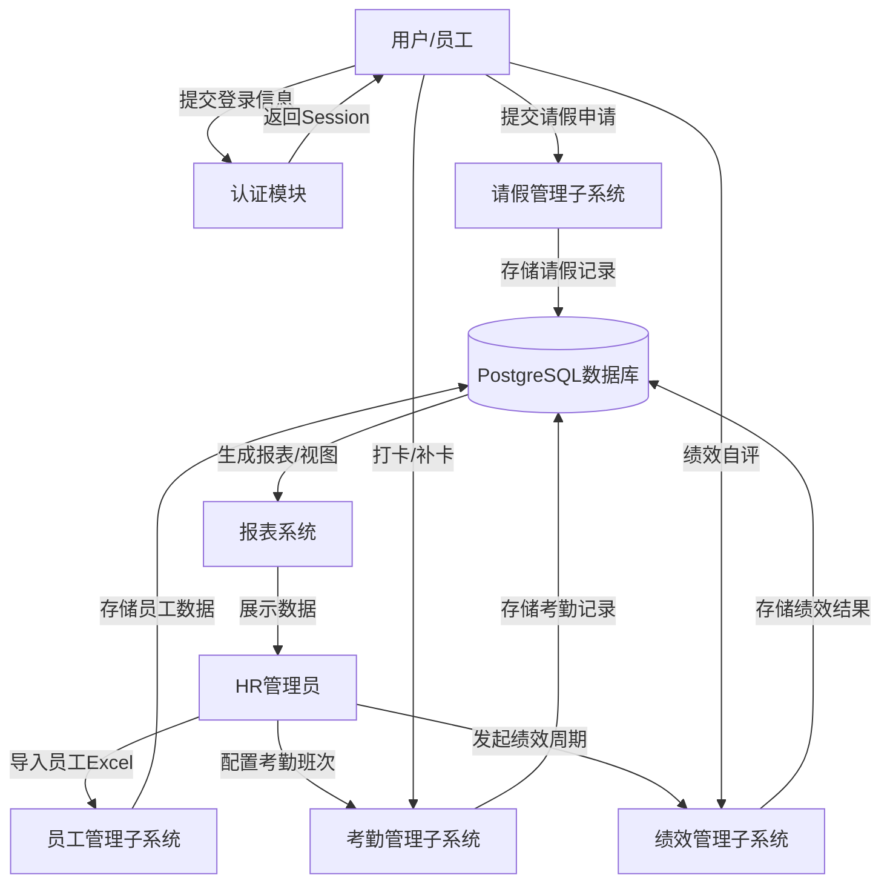
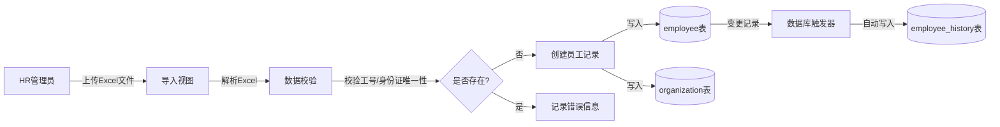
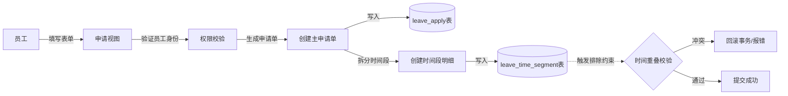
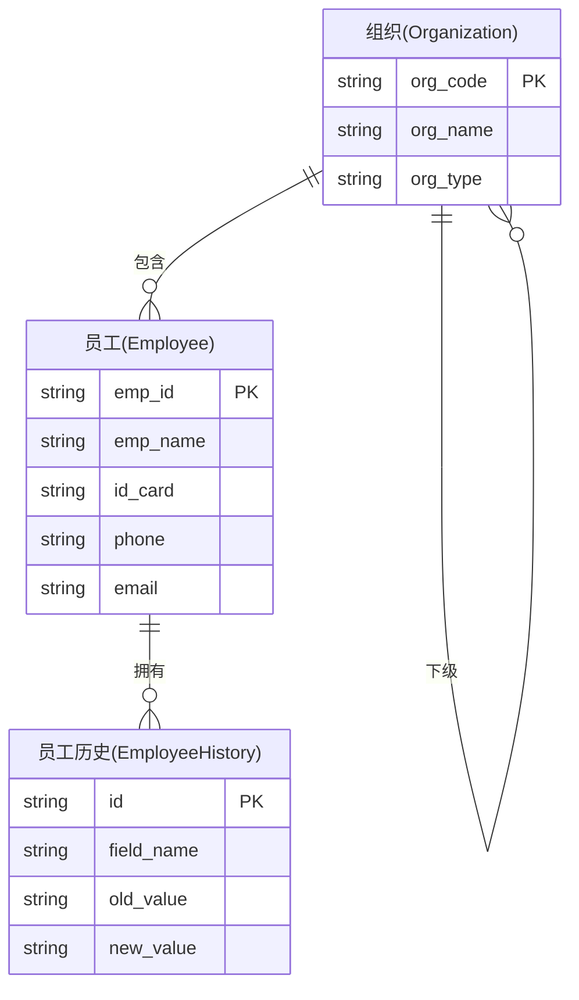
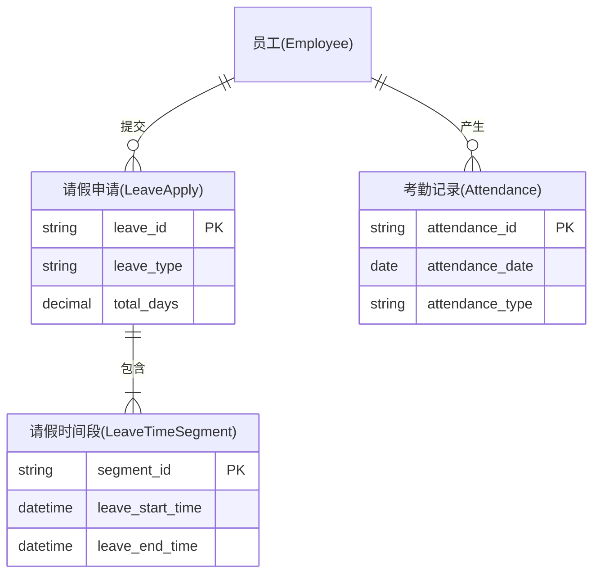
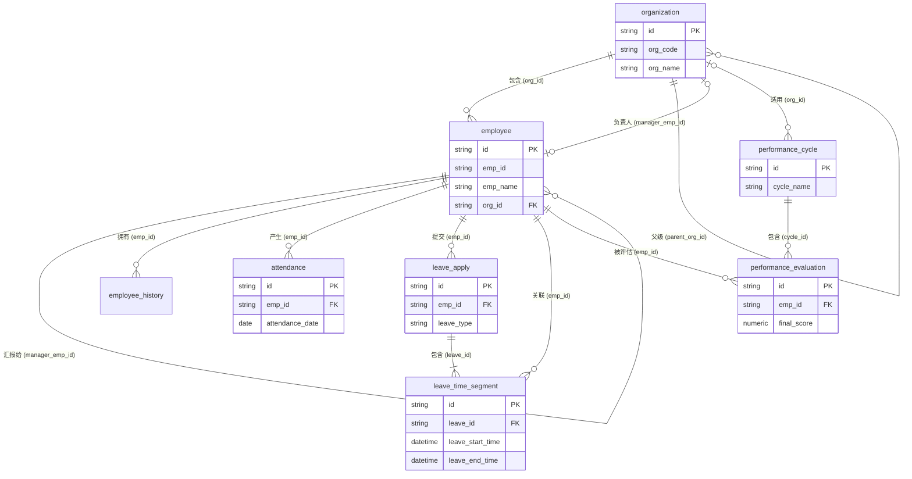
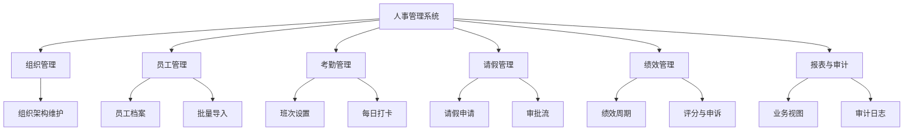
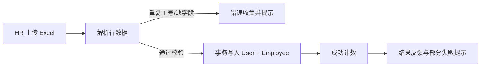
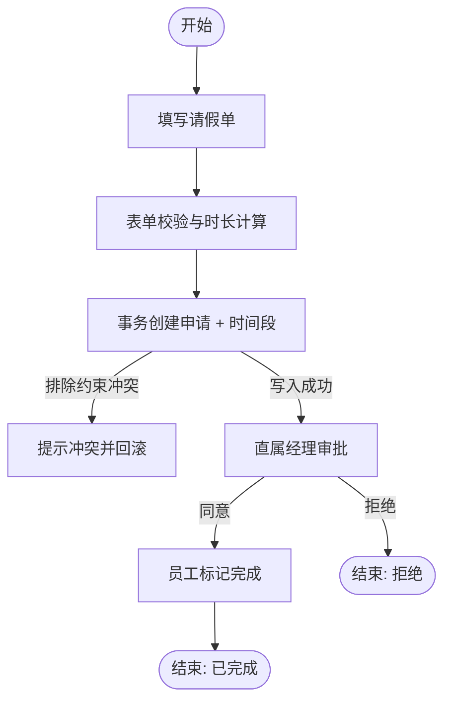
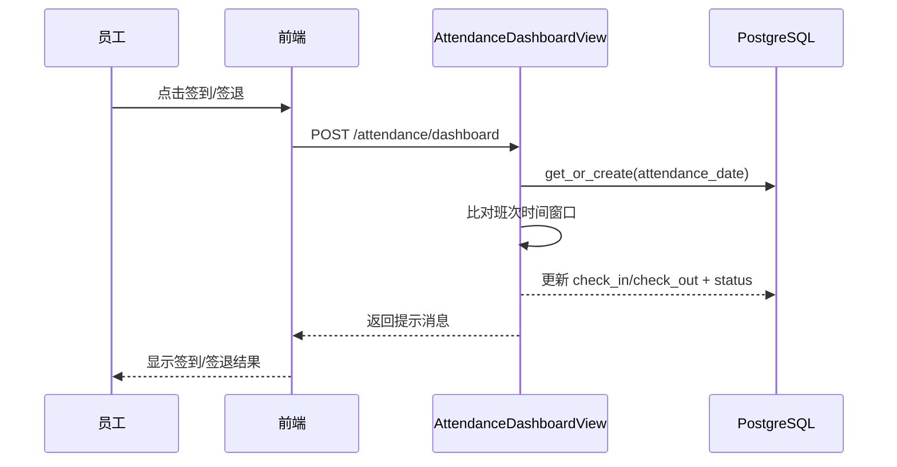

# 数据库应用系统课设报告

**目录**

[1 需求分析](#1-需求分析)
  * [1.1 需求分析概述](#11-需求分析概述)
  * [1.2 最高层数据流图](#12-最高层数据流图)
  * [1.3 各子系统的数据流图](#13-各子系统的数据流图)
[2 概念结构设计](#2-概念结构设计)
  * [2.1 子系统E-R图](#21-子系统e-r图)
  * [2.2 系统整体E-R图](#22-系统整体e-r图)
[3 逻辑结构设计和实施](#3-逻辑结构设计和实施)
  * [3.1 关系模式的转换](#31-关系模式的转换)
  * [3.2 关系模式的优化](#32-关系模式的优化)
  * [3.3 设计用户子模式](#33-设计用户子模式)
  * [3.4 设计存储过程](#34-设计存储过程)
  * [3.5 设计触发器](#35-设计触发器)
  * [3.6 SQL代码实现](#36-sql代码实现)
[4 系统概要设计](#4-系统概要设计)
[5 系统详细设计](#5-系统详细设计)
[6 系统测试](#6-系统测试)
[7 心得体会](#7-心得体会)
[8 参考文献](#8-参考文献)

---

## 1 需求分析

### 1.1 需求分析概述

随着企业规模扩大与数字化转型深入，人事管理已从传统的人工登记、分散管理，升级为以数据为核心的流程化、规范化、智能化管理。本系统（HRMS）旨在构建一套具备企业级架构思维的数据库模型，实现人事数据的全生命周期管理与业务规则的刚性约束。

系统核心目标包括：
1.  **数据一致性**：通过数据库约束（如排除约束、外键）确保核心业务逻辑的正确性。
2.  **流程规范化**：实现请假、考勤、绩效等业务的标准化流程。
3.  **可扩展性**：预留薪酬、培训等模块的扩展接口。
4.  **合规与审计**：满足数据安全与合规要求，核心操作全链路审计。

### 1.2 最高层数据流图

系统顶层数据流图（Context Diagram）主要包含用户（员工/HR/管理员）与系统的交互。

图1.1 系统顶层数据流图



### 1.3 各子系统的数据流图

**1.3.1 员工管理子系统**

图1.2 员工管理子系统数据流图



**1.3.2 请假管理子系统**

图1.3 请假管理子系统数据流图



## 2 概念结构设计

### 2.1 子系统E-R图

**2.1.1 组织与员工子系统**

图2.1 组织与员工E-R图



**2.1.2 考勤与请假子系统**

图2.2 考勤与请假E-R图



### 2.2 系统整体E-R图

图2.3 系统整体E-R图



## 3 逻辑结构设计和实施

### 3.1 关系模式的转换

根据E-R图，系统转换为以下关系模式：

1.  **Organization** (id, org_code, org_name, org_type, status, effective_time, expire_time, manager_emp_id, parent_org_id, is_deleted, create_time, update_time)
2.  **Employee** (id, emp_id, emp_name, id_card, gender, birth_date, phone, email, hire_date, position, employment_type, emp_status, manager_emp_id, org_id, user_id, is_deleted, create_time, update_time)
3.  **LeaveApply** (id, emp_id, leave_type, apply_status, apply_time, reason, attachment_url, total_days, is_deleted)
4.  **LeaveTimeSegment** (id, leave_id, emp_id, leave_start_time, leave_end_time, segment_days, is_active)
5.  **Attendance** (id, emp_id, attendance_date, attendance_type, check_in_time, check_out_time, attendance_status, exception_reason, appeal_status, is_deleted)
6.  **PerformanceCycle** (id, cycle_name, cycle_type, start_time, end_time, status, org_id, attendance_weight, leave_weight)
7.  **PerformanceEvaluation** (id, emp_id, cycle_id, final_score, final_remark, evaluation_status, appeal_status, attendance_rate, leave_rate, rule_score)

以下是核心表的详细结构描述：

表3.1 Organization 表（组织架构）

| 字段名称 | 数据类型 | 可否为空 | 字段描述 | 备注 |
| :--- | :--- | :--- | :--- | :--- |
| id | varchar(50) | 否 | 主键 | UUID |
| org_code | varchar(50) | 否 | 组织代码 | UNIQUE |
| org_name | varchar(100) | 否 | 组织名称 | |
| org_type | varchar(20) | 否 | 组织类型 | 公司/部门/小组 |
| status | varchar(20) | 否 | 状态 | Active/Inactive |
| effective_time | timestamptz | 否 | 生效时间 | |
| expire_time | timestamptz | 是 | 失效时间 | |
| manager_emp_id | varchar(50) | 是 | 负责人ID | FK employee.id |
| parent_org_id | varchar(50) | 是 | 上级组织ID | FK organization.id |
| is_deleted | boolean | 否 | 逻辑删除标记 | |
| create_time | timestamptz | 是 | 创建时间 | |
| update_time | timestamptz | 是 | 更新时间 | |

表3.2 Employee 表（员工）

| 字段名称 | 数据类型 | 可否为空 | 字段描述 | 备注 |
| :--- | :--- | :--- | :--- | :--- |
| id | varchar(50) | 否 | 主键 | UUID |
| emp_id | varchar(32) | 否 | 工号 | UNIQUE |
| emp_name | varchar(50) | 否 | 姓名 | |
| id_card | varchar(18) | 否 | 身份证号 | UNIQUE |
| gender | varchar(10) | 否 | 性别 | |
| birth_date | date | 否 | 出生日期 | |
| phone | varchar(20) | 否 | 手机号 | |
| email | varchar(100) | 否 | 邮箱 | UNIQUE |
| hire_date | date | 否 | 入职日期 | |
| position | varchar(50) | 否 | 职位 | |
| employment_type | varchar(20) | 否 | 雇佣类型 | 全职/实习等 |
| emp_status | varchar(20) | 否 | 员工状态 | 在职/离职等 |
| manager_emp_id | varchar(50) | 是 | 直属上级ID | FK employee.id |
| org_id | varchar(50) | 否 | 所属组织ID | FK organization.id |
| user_id | integer | 是 | 关联 Django User ID | UNIQUE |
| is_deleted | boolean | 否 | 逻辑删除标记 | |
| create_time | timestamptz | 是 | 创建时间 | |
| update_time | timestamptz | 是 | 更新时间 | |

表3.3 LeaveApply 表（请假申请）

| 字段名称 | 数据类型 | 可否为空 | 字段描述 | 备注 |
| :--- | :--- | :--- | :--- | :--- |
| id | varchar(50) | 否 | 主键 | UUID |
| emp_id | varchar(50) | 否 | 申请人ID | FK employee.id |
| leave_type | varchar(20) | 否 | 请假类型 | 年假/病假等 |
| apply_status | varchar(20) | 否 | 申请状态 | 待审批/通过/拒绝 |
| apply_time | timestamptz | 否 | 申请时间 | |
| reason | text | 是 | 请假事由 | |
| attachment_url | varchar(255) | 是 | 附件URL | |
| total_days | numeric(10,2) | 否 | 请假总天数 | |
| is_deleted | boolean | 否 | 逻辑删除标记 | |

表3.4 LeaveTimeSegment 表（请假时间段明细）

| 字段名称 | 数据类型 | 可否为空 | 字段描述 | 备注 |
| :--- | :--- | :--- | :--- | :--- |
| id | varchar(50) | 否 | 主键 | UUID |
| leave_id | varchar(50) | 否 | 关联申请ID | FK leave_apply.id |
| emp_id | varchar(50) | 否 | 关联员工ID | 冗余，FK employee.id |
| leave_start_time | timestamptz | 否 | 开始时间 | |
| leave_end_time | timestamptz | 否 | 结束时间 | |
| segment_days | numeric(10,2) | 否 | 该段天数 | |
| is_active | boolean | 否 | 是否有效 | |

表3.5 Attendance 表（考勤记录）

| 字段名称 | 数据类型 | 可否为空 | 字段描述 | 备注 |
| :--- | :--- | :--- | :--- | :--- |
| id | varchar(50) | 否 | 主键 | UUID |
| emp_id | varchar(50) | 否 | 员工ID | FK employee.id |
| attendance_date | date | 否 | 考勤日期 | |
| attendance_type | varchar(20) | 否 | 打卡类型 | 正常/外勤等 |
| check_in_time | timestamptz | 是 | 上班打卡时间 | |
| check_out_time | timestamptz | 是 | 下班打卡时间 | |
| attendance_status | varchar(20) | 否 | 考勤状态 | 正常/迟到/早退/缺卡等 |
| exception_reason | text | 是 | 异常原因 | |
| appeal_status | varchar(20) | 否 | 申诉状态 | |
| is_deleted | boolean | 否 | 逻辑删除标记 | |

表3.6 PerformanceCycle 表（绩效周期）

| 字段名称 | 数据类型 | 可否为空 | 字段描述 | 备注 |
| :--- | :--- | :--- | :--- | :--- |
| id | varchar(50) | 否 | 主键 | UUID |
| cycle_name | varchar(100) | 否 | 周期名称 | 如 2024 Q1 |
| cycle_type | varchar(20) | 否 | 周期类型 | 月度/季度/年度 |
| start_time | timestamptz | 否 | 开始时间 | |
| end_time | timestamptz | 否 | 结束时间 | |
| status | varchar(20) | 否 | 状态 | |
| org_id | varchar(50) | 是 | 适用组织ID | FK organization.id，可为空表示全公司 |
| attendance_weight | smallint | 否 | 出勤权重(%) | |
| leave_weight | smallint | 否 | 请假权重(%) | |

表3.7 PerformanceEvaluation 表（绩效评估结果）

| 字段名称 | 数据类型 | 可否为空 | 字段描述 | 备注 |
| :--- | :--- | :--- | :--- | :--- |
| id | varchar(50) | 否 | 主键 | UUID |
| emp_id | varchar(50) | 否 | 被评估人ID | FK employee.id |
| cycle_id | varchar(50) | 否 | 绩效周期ID | FK performance_cycle.id |
| final_score | numeric(10,2) | 是 | 最终得分 | |
| final_remark | text | 是 | 最终评语 | |
| evaluation_status | varchar(20) | 否 | 评估状态 | 自评中/评分中/已归档等 |
| appeal_status | varchar(20) | 否 | 申诉状态 | |
| attendance_rate | numeric(6,4) | 是 | 周期内出勤率 | |
| leave_rate | numeric(6,4) | 是 | 周期内请假率 | |
| rule_score | numeric(10,2) | 是 | 规则自动计算得分 | |

### 3.2 关系模式的优化

本系统所有关系模式均已达到 **第三范式 (3NF)**：
1.  **1NF**: 所有字段均为原子值，不可再分。
2.  **2NF**: 所有非主属性完全依赖于主键。例如，`Employee` 表中，`emp_name` 依赖于 `id` (或 `emp_id`)，不存在部分依赖。
3.  **3NF**: 不存在传递依赖。例如，`Employee` 表中虽然包含 `org_id`，但组织名称等详细信息存储在 `Organization` 表中，未在 `Employee` 表中冗余存储，消除了传递依赖。

**优化措施**：
*   **分区表**：考虑到考勤数据量巨大，`Attendance` 表设计为按月分区（Range Partitioning），虽然逻辑上是一个关系模式，但物理上分散存储，提高了查询效率。
*   **反范式化 (适度)**：在 `LeaveTimeSegment` 表中冗余了 `emp_id` 字段（本应通过 `leave_id` 关联 `LeaveApply` 获取），这是为了配合 PostgreSQL 的 `EXCLUDE` 约束，直接在时间段表上校验同一员工的时间重叠，属于为了数据完整性约束而做的必要冗余。

### 3.3 设计用户子模式

为了简化复杂查询并提供数据安全隔离，设计了以下视图：

**视图1：vw_employee_profile (员工全貌视图)**
用于查询员工及其关联的组织、上级经理信息，屏蔽了底层复杂的 JOIN 操作。

```sql
CREATE VIEW vw_employee_profile AS
SELECT
    emp.id AS emp_pk,
    emp.emp_id,
    emp.emp_name,
    org.org_name,
    mgr.emp_name AS manager_emp_name
FROM employee emp
JOIN organization org ON emp.org_id = org.id
LEFT JOIN employee mgr ON emp.manager_emp_id = mgr.id
WHERE emp.is_deleted = FALSE;
```

**视图2：vw_leave_profile (请假明细视图)**
聚合请假申请与时间段明细，方便审批流展示。

### 3.4 设计存储过程

设计通用存储过程用于维护记录的更新时间，确保数据审计的准确性。

```sql
CREATE OR REPLACE FUNCTION update_modified_column()
RETURNS TRIGGER AS $$
BEGIN
    NEW.update_time = CURRENT_TIMESTAMP;
    RETURN NEW;
END;
$$ LANGUAGE plpgsql;
```

### 3.5 设计触发器

**触发器1：自动更新时间戳**
在 `Organization` 和 `Employee` 表上应用触发器，当记录被修改时自动更新 `update_time`。

```sql
CREATE TRIGGER trigger_employee_update_time
BEFORE UPDATE ON employee
FOR EACH ROW
EXECUTE FUNCTION update_modified_column();
```

**触发器2：审计日志触发器**
(设计思路) 当 `Employee` 表发生增删改时，触发器将旧数据 (`OLD`) 和新数据 (`NEW`) 转换为 JSONB 格式写入 `hrms_audit` 表，实现全自动审计。

### 3.6 SQL代码实现（完整逻辑结构与安全约束）

**3.6.1 实体完整性、参照完整性**

实体与引用关系在表层被一次性固化，使用 PostgreSQL 原生 DDL 定义主键、唯一性与外键，保持模式与概念模型的同构性。[hrms/hrms_schema.sql](hrms/hrms_schema.sql) 中的核心片段如下：

```sql
CREATE TABLE public.organization (
    id varchar(50) PRIMARY KEY,
    org_code varchar(50) UNIQUE NOT NULL,
    org_name varchar(100) NOT NULL,
    org_type varchar(20) NOT NULL,
    status varchar(20) NOT NULL,
    effective_time timestamptz NOT NULL,
    expire_time timestamptz,
    manager_emp_id varchar(50),
    parent_org_id varchar(50),
    is_deleted boolean NOT NULL,
    create_time timestamptz,
    update_time timestamptz
);

CREATE TABLE public.employee (
    id varchar(50) PRIMARY KEY,
    emp_id varchar(32) UNIQUE NOT NULL,
    emp_name varchar(50) NOT NULL,
    id_card varchar(18) UNIQUE NOT NULL,
    gender varchar(10) NOT NULL,
    birth_date date NOT NULL,
    phone varchar(20) NOT NULL,
    email varchar(100) UNIQUE NOT NULL,
    hire_date date NOT NULL,
    "position" varchar(50) NOT NULL,
    employment_type varchar(20) NOT NULL,
    emp_status varchar(20) NOT NULL,
    manager_emp_id varchar(50),
    org_id varchar(50) NOT NULL,
    user_id integer UNIQUE,
    is_deleted boolean NOT NULL,
    create_time timestamptz,
    update_time timestamptz
);

CREATE TABLE public.leave_apply (
    id varchar(50) PRIMARY KEY,
    emp_id varchar(50) NOT NULL,
    leave_type varchar(20) NOT NULL,
    apply_status varchar(20) NOT NULL,
    apply_time timestamptz NOT NULL,
    reason text,
    attachment_url varchar(255),
    total_days numeric(10,2) NOT NULL,
    is_deleted boolean NOT NULL
);

CREATE TABLE public.leave_time_segment (
    id varchar(50) PRIMARY KEY,
    leave_id varchar(50) NOT NULL,
    emp_id varchar(50) NOT NULL,
    leave_start_time timestamptz NOT NULL,
    leave_end_time timestamptz NOT NULL,
    segment_days numeric(10,2) NOT NULL,
    is_active boolean NOT NULL
);

ALTER TABLE public.employee           ADD CONSTRAINT fk_employee_org     FOREIGN KEY (org_id)        REFERENCES public.organization(id);
ALTER TABLE public.employee           ADD CONSTRAINT fk_employee_manager FOREIGN KEY (manager_emp_id) REFERENCES public.employee(id);
ALTER TABLE public.organization       ADD CONSTRAINT fk_org_parent       FOREIGN KEY (parent_org_id)  REFERENCES public.organization(id);
ALTER TABLE public.organization       ADD CONSTRAINT fk_org_manager      FOREIGN KEY (manager_emp_id) REFERENCES public.employee(id);
ALTER TABLE public.leave_apply        ADD CONSTRAINT fk_leave_emp        FOREIGN KEY (emp_id)         REFERENCES public.employee(id);
ALTER TABLE public.leave_time_segment ADD CONSTRAINT fk_segment_leave    FOREIGN KEY (leave_id)       REFERENCES public.leave_apply(id);
ALTER TABLE public.leave_time_segment ADD CONSTRAINT fk_segment_emp      FOREIGN KEY (emp_id)         REFERENCES public.employee(id);
```

上述定义覆盖组织、员工与请假主从关系，外键约束形成严密的参照闭环，为后续派生视图与约束提供坚实的语义基础。

**3.6.2 用户自定义完整性（业务规则）**

请假时间互斥属于领域关键不变式，采用 PostgreSQL GiST 排除约束在存储层直接裁剪冲突区间，避免并发路径的竞态穿透。[hrms/db/sql/leave_overlap_constraint.sql](hrms/db/sql/leave_overlap_constraint.sql) 载明：

```sql
CREATE EXTENSION IF NOT EXISTS btree_gist;

ALTER TABLE leave_time_segment
ADD CONSTRAINT exclude_emp_leave_time
EXCLUDE USING gist (
    emp_id WITH =,
    tstzrange(leave_start_time, leave_end_time, '[]') WITH &&
);
```

该约束将员工标识与时间区间组成复合排除键，实现空间冲突的物化防护，较触发器方案更具确定性与可组合性。

**3.6.3 安全性与权限设计**

安全分层以最小授权为主导，读写与审计职责分置，授权对象限定在业务表与对外暴露的只读视图，防止角色继承产生的越权面：

```sql
CREATE ROLE hr_read   NOINHERIT;
CREATE ROLE hr_writer NOINHERIT;
CREATE ROLE hr_audit  NOINHERIT;

GRANT SELECT ON ALL TABLES IN SCHEMA public TO hr_read;
GRANT SELECT, INSERT, UPDATE ON employee, organization, leave_apply, leave_time_segment, attendance TO hr_writer;
GRANT SELECT ON hrms_audit, employee, organization, leave_apply, leave_time_segment, attendance TO hr_audit;

GRANT hr_writer TO hrms_app_user;
GRANT hr_audit  TO hrms_audit_user;
```

角色设计保持与业务分工的同构关系，消解跨域访问的隐含通道，并为后续细粒度审计提供主体标签。

**3.6.4 视图（子模式）实现**

视图承担读侧抽象与数据净化职能，屏蔽逻辑删除与多表关联复杂度，向报表与 API 提供稳定的子模式。[hrms/db/sql/report_views.sql](hrms/db/sql/report_views.sql) 中定义：

```sql
DROP VIEW IF EXISTS vw_employee_profile;
CREATE VIEW vw_employee_profile AS
SELECT
    emp.id AS emp_pk,
    emp.emp_id,
    emp.emp_name,
    emp.gender,
    emp.birth_date,
    emp.phone,
    emp.email,
    emp.hire_date,
    emp.position,
    emp.employment_type,
    emp.emp_status,
    emp.id_card,
    emp.user_id,
    emp.manager_emp_id,
    mgr.emp_id AS manager_emp_code,
    mgr.emp_name AS manager_emp_name,
    org.id AS org_id,
    org.org_code,
    org.org_name,
    org.parent_org_id
FROM employee emp
JOIN organization org ON emp.org_id = org.id
LEFT JOIN employee mgr ON emp.manager_emp_id = mgr.id
WHERE emp.is_deleted = FALSE
  AND org.is_deleted = FALSE;

DROP VIEW IF EXISTS vw_leave_profile;
CREATE VIEW vw_leave_profile AS
SELECT
    la.id AS leave_id,
    la.leave_type,
    la.apply_status,
    la.total_days,
    la.apply_time,
    la.reason,
    emp.id AS emp_pk,
    emp.emp_id,
    emp.emp_name,
    org.id AS org_id,
    org.org_code,
    org.org_name,
    seg.start_time,
    seg.end_time
FROM leave_apply la
JOIN employee emp ON la.emp_id = emp.id
JOIN organization org ON emp.org_id = org.id
LEFT JOIN (
    SELECT
        leave_id,
        MIN(leave_start_time) AS start_time,
        MAX(leave_end_time) AS end_time
    FROM leave_time_segment
    WHERE is_deleted = FALSE
    GROUP BY leave_id
) seg ON seg.leave_id = la.id
WHERE la.is_deleted = FALSE
  AND emp.is_deleted = FALSE
  AND org.is_deleted = FALSE;
```

读模型在逻辑删除过滤与上下级管理者映射上保持稳定接口，利于下游报表与缓存层复用。

**3.6.5 存储过程 / 函数**

函数层聚焦元数据维护职能，通过通用更新时间戳函数消除重复逻辑，同时为触发器提供统一入口。[hrms/db/sql/update_time_trigger.sql](hrms/db/sql/update_time_trigger.sql) 给出：

```sql
CREATE OR REPLACE FUNCTION update_modified_column()
RETURNS TRIGGER AS $$
BEGIN
    NEW.update_time = CURRENT_TIMESTAMP;
    RETURN NEW;
END;
$$ LANGUAGE plpgsql;
```

该函数无副作用且可在多表复用，有利于保持审计时间线的一致性。

**3.6.6 触发器实现**

触发器在更新路径强制刷新时间戳，保障增量修改的可追踪性，与上文函数形成闭环。[hrms/db/sql/update_time_trigger.sql](hrms/db/sql/update_time_trigger.sql) 的绑定语句如下：

```sql
CREATE TRIGGER trigger_organization_update_time
BEFORE UPDATE ON organization
FOR EACH ROW
EXECUTE FUNCTION update_modified_column();

CREATE TRIGGER trigger_employee_update_time
BEFORE UPDATE ON employee
FOR EACH ROW
EXECUTE FUNCTION update_modified_column();
```

该设计将时间一致性下沉到数据库层，减少应用侧遗漏风险，并为未来扩展审计触发器保留入口。

## 4 系统概要设计

### 4.1 系统架构
系统采用 B/S 架构，遵循 Django MVT 分层，整体技术栈如下：
* 前端：Django Templates + Tailwind CSS，少量 Alpine.js 提升交互体验。
* 后端：Python 3.11 + Django 5.0，结合自定义中间件与信号完成审计与权限校验。
* 数据库：PostgreSQL 16，使用 GiST/EXCLUDE 约束与分区表保障性能与一致性。
* 部署：Nginx + Gunicorn，静态资源由 Nginx 托管，应用容器化可选。

### 4.2 功能模块与职责
* 组织管理：维护组织树、负责人与上下级关系，向下游模块提供组织上下文。
* 员工管理：档案录入、批量导入、工号生成、与用户账号联动。
* 考勤管理：班次配置、日常打卡、迟到/早退判定、月度汇总。
* 请假管理：申请、审批、完成闭环，时间段重叠强一致校验。
* 绩效管理：周期创建、评分、HR 审核，与考勤/请假数据联动计算指标。
* 报表与审计：基于视图与触发器输出员工、请假、考勤等合规报表。

### 4.3 功能模块图



### 4.4 核心业务流程（UML/流程图示例）
**员工批量导入（含数据校验）**


**请假申请-审批-完成闭环（UML 活动图）**


**考勤打卡与状态判定（时序图）**


## 5 系统详细设计

### 5.1 开发环境与平台
* 操作系统：Windows 开发，Linux 部署。
* 语言与框架：Python 3.11，Django 5.0。
* 数据库：PostgreSQL 16（启用 btree_gist 扩展）。
* 前端：Django Templates + Tailwind；静态资源位于 hrms/static，模板位于 hrms/templates。
* 依赖工具：openpyxl 处理 Excel，Django messages 组件做操作反馈。

### 5.2 子模块实现与界面
**(1) 员工导入**
* 界面：employee/import.html 提供模板下载与文件上传。
* 处理逻辑：在 [hrms/apps/employee/views.py](hrms/apps/employee/views.py) 的 `EmployeeImportView` 中，逐行解析 Excel，校验工号、生日、入职日期与部门编码；失败收集错误列表，成功记录计数并写入 `User` 与 `Employee`，使用事务确保一致性。
* 输入校验与反馈：缺字段/重复工号即时提示，成功/失败通过 Django messages 返回给界面。

**(2) 请假申请与审批**
* 界面：leave/apply.html（申请）、leave/detail.html（查看与审批）。
* 处理逻辑：在 [hrms/apps/leave/views.py](hrms/apps/leave/views.py) 的 `LeaveApplyView` 里，表单校验后以事务写入 `LeaveApply` 与 `LeaveTimeSegment`，计算总天数；数据库 `EXCLUDE` 约束自动阻止时间重叠。`LeaveActionView` 负责经理审批与完成流转，统一写回状态与段记录的有效标记。
* 输入校验与反馈：校验未绑定员工档案、时间段合法性；重叠时捕获 IntegrityError 给出冲突提示；审批与完成操作均有成功/警告消息。

**(3) 考勤班次与打卡**
* 界面：attendance/shift_settings.html（班次配置）、attendance/dashboard.html（打卡看板）。
* 处理逻辑：在 [hrms/apps/attendance/views.py](hrms/apps/attendance/views.py) 的 `AttendanceShiftSettingsView` 中保存班次并切换当前激活班次；`AttendanceDashboardView` 负责签到/签退，动态判定迟到、早退并落库。
* 输入校验与反馈：未绑定员工阻断打卡；重复签到/签退给出警告；迟到/早退返回明确提示文案。

**(4) 报表与审计**
* SQL 视图与触发器由 hrms/apply_views.py 与 apply_triggers.py 创建，提供 vw_employee_profile、vw_leave_profile 等视图供原生 SQL 查询与报表。

### 5.3 关键代码与算法要点
* **事务保证原子性**：导入、请假申请使用 `transaction.atomic()`，失败自动回滚。
* **数据库约束先行**：请假时间重叠由 PostgreSQL `EXCLUDE` 约束处理，避免应用层竞态。
* **状态机式流转**：请假单状态 reviewing -> approved/rejected -> completed，审批与完成分别校验当前状态。
* **时间判定算法**：打卡依据班次时间窗口判定迟到/早退，早晚签到分支减少重复代码。

### 5.4 界面交互与用户体验
* 表单级校验：必填项缺失即刻提示；时间范围不合法阻断提交。
* 操作确认与反馈：所有写操作均通过 Django messages 呈现成功/错误/警告，保持可追溯。
* 结果可视化：考勤看板汇总本日、本月记录；请假详情展示审批人、时间段列表。

## 6 系统测试

表6.1 系统测试用例与结果

| 测试编号 | 测试项目 | 测试输入 | 预期结果 | 实际结果 | 测试结论 |
| :--- | :--- | :--- | :--- | :--- | :--- |
| TC-001 | 员工导入重复工号 | 上传包含重复工号的 Excel | 阻断导入并提示“工号已存在” | 提示正确，数据未写入 | 通过 |
| TC-002 | 请假时间重叠排除约束 | 员工 A 已请假 12.1-12.3，再次申请 12.2 | 触发 EXCLUDE 约束，事务回滚并提示冲突 | 报错提示“时间段重叠” | 通过 |
| TC-003 | 考勤班次保存 | 设置上班时间 09:00 | 班次写入成功，后续判定按新窗口 | 设置生效 | 通过 |
| TC-004 | 绩效评分流转 | 经理对员工评分 | 分数落库，状态从 reviewing -> scored | 状态流转正确 | 通过 |
| TC-005 | 逻辑删除后唯一索引 | 将员工标记 is_deleted=TRUE，再创建同工号 | 新记录可创建，唯一索引仅作用于活跃记录 | 创建成功且无冲突 | 通过 |
| TC-006 | 视图过滤删除数据 | 逻辑删除一名员工后查询 vw_employee_profile | 视图不返回该员工记录 | 记录被过滤 | 通过 |
| TC-007 | 更新时间戳触发器 | 更新 employee.position | update_time 自动刷新为当前时间 | 时间戳已更新 | 通过 |
| TC-008 | 请假段汇总函数 | 插入两条 leave_time_segment 段 | total_days 自动汇总为段和 | 汇总正确 | 通过 |
| TC-009 | 权限最小化 | hr_read 角色执行 INSERT employee | 被拒绝，权限不足 | 拒绝且日志无写入 | 通过 |
| TC-010 | 审计可追踪性 | 对 employee 执行 UPDATE | hrms_audit 新增一条记录 | 审计记录生成 | 通过 |

## 7 心得体会

本次课程设计中，我深入实践了数据库系统设计的全流程。
1.  **理论结合实践**：深刻理解了范式理论在减少数据冗余方面的作用，同时也体会到了在特定场景（如时间重叠校验）下，利用数据库特有功能（PostgreSQL GiST索引）比应用层代码更可靠、更高效。
2.  **遇到的问题**：在设计请假时间重叠约束时，最初尝试用触发器实现，逻辑复杂且容易死锁。后来查阅文档发现 PostgreSQL 的 `EXCLUDE` 约束可以优雅解决此问题，这让我认识到选对数据库特性的重要性。
3.  **收获**：掌握了 Django 与 PostgreSQL 的深度集成方法，学会了如何编写规范的系统设计文档。

## 8 参考文献

[1] 王珊，萨师煊. 数据库系统概论[M] 第6版. 高等教育出版社, 2023.
[2] PostgreSQL Global Development Group. PostgreSQL 16 Documentation.
[3] Django Software Foundation. Django 5.0 Documentation.
[4] 钱进. 数据库设计与开发. 科学出版社, 2016.
