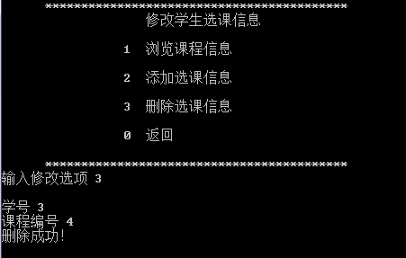

ziji{width="2.25in" height="0.50625in"}

{width="0.6847222222222222in"
height="0.6847222222222222in"}
{width="1.8541666666666667in"
height="0.3923611111111111in"}

**《软件测试》**

**课程设计报告**

  --------------------- -------------------------------------------------
      **题 目 ：**               基于\*\*\*系统的功能自动化测试

   **专 业 班 级 ：**                      软件2301班

   **学 生 姓 名 ：**                         张三

      **学 号 ：**                        241210400920

   **指 导 教 师 ：**                     课设老师名字

   **课程设计时间：**                 2025.12.22\--2026.1.2
  --------------------- -------------------------------------------------

**[软件工程]{.underline} 专业课程设计任务书**

+:-------:+:------------:+:----:+:-:+:--------:+:-:+:----:+:------------:+
| **学生  |              | **专 |   |          | * |      |              |
| 姓名**  |              | 业班 |   |          | * |      |              |
|         |              | 级** |   |          | 学 |     |              |
|         |              |      |   |          | 号 |     |              |
|         |              |      |   |          | * |      |              |
|         |              |      |   |          | * |      |              |
+---------+--------------+------+---+----------+---+------+--------------+
| **题    |              |      |   |          |   |      |              |
| 目**    |              |      |   |          |   |      |              |
+---------+--------------+------+---+----------+---+------+--------------+
| **课题  | 工程设计     |      | * |          |   | 自拟 |              |
| 性质**  |              |      | * |          |   | 课题 |              |
|         |              |      | 课 |         |   |      |              |
|         |              |      | 题 |         |   |      |              |
|         |              |      | 来 |         |   |      |              |
|         |              |      | 源 |         |   |      |              |
|         |              |      | * |          |   |      |              |
|         |              |      | * |          |   |      |              |
+---------+--------------+------+---+----------+---+------+--------------+
| **指导  |              |      | * |          |   | 无   |              |
| 教师**  |              |      | * |          |   |      |              |
|         |              |      | 同 |         |   |      |              |
|         |              |      | 组 |         |   |      |              |
|         |              |      | 姓 |         |   |      |              |
|         |              |      | 名 |         |   |      |              |
|         |              |      | * |          |   |      |              |
|         |              |      | * |          |   |      |              |
+---------+--------------+------+---+----------+---+------+--------------+
| **主要  | 综合         |      |   |          |   |      |              |
| 内容**  | 应用所学的软 |      |   |          |   |      |              |
|         | 件测试理论和 |      |   |          |   |      |              |
|         | 方法，实现\* |      |   |          |   |      |              |
|         | \*系统的功能 |      |   |          |   |      |              |
|         | 自动化测试。 |      |   |          |   |      |              |
|         |              |      |   |          |   |      |              |
|         | （           |      |   |          |   |      |              |
|         | 1）自动化测  |      |   |          |   |      |              |
|         | 试介绍，适用 |      |   |          |   |      |              |
|         | 场景及优势； |      |   |          |   |      |              |
|         |              |      |   |          |   |      |              |
|         | （2）自动    |      |   |          |   |      |              |
|         | 化功能测试框 |      |   |          |   |      |              |
|         | 架技术栈介绍 |      |   |          |   |      |              |
|         | 及环境搭建； |      |   |          |   |      |              |
|         |              |      |   |          |   |      |              |
|         | （3          |      |   |          |   |      |              |
|         | ）系统功能测 |      |   |          |   |      |              |
|         | 试用例设计； |      |   |          |   |      |              |
|         |              |      |   |          |   |      |              |
|         | （           |      |   |          |   |      |              |
|         | 4）编写自动  |      |   |          |   |      |              |
|         | 化测试脚本； |      |   |          |   |      |              |
|         |              |      |   |          |   |      |              |
|         | （5）测试    |      |   |          |   |      |              |
|         | 评价与结论。 |      |   |          |   |      |              |
+---------+--------------+------+---+----------+---+------+--------------+
| **任务  | （1）能够    |      |   |          |   |      |              |
| 要求**  | 将课本上的理 |      |   |          |   |      |              |
|         | 论知识和实际 |      |   |          |   |      |              |
|         | 问题有机的结 |      |   |          |   |      |              |
|         | 合起来，掌握 |      |   |          |   |      |              |
|         | 分析和解决实 |      |   |          |   |      |              |
|         | 际工程问题的 |      |   |          |   |      |              |
|         | 方法和能力； |      |   |          |   |      |              |
|         |              |      |   |          |   |      |              |
|         | （2          |      |   |          |   |      |              |
|         | ）能够按照设 |      |   |          |   |      |              |
|         | 计题目要求进 |      |   |          |   |      |              |
|         | 行方案设计和 |      |   |          |   |      |              |
|         | 实现；在设计 |      |   |          |   |      |              |
|         | 实现中能够体 |      |   |          |   |      |              |
|         | 现良好的身心 |      |   |          |   |      |              |
|         | 素质和团队； |      |   |          |   |      |              |
|         |              |      |   |          |   |      |              |
|         | （3）在答辩  |      |   |          |   |      |              |
|         | 过程中要求具 |      |   |          |   |      |              |
|         | 有良好的表达 |      |   |          |   |      |              |
|         | 能力，专业的 |      |   |          |   |      |              |
|         | 描述方法，并 |      |   |          |   |      |              |
|         | 能进行良好的 |      |   |          |   |      |              |
|         | 沟通和交流； |      |   |          |   |      |              |
|         |              |      |   |          |   |      |              |
|         | （4）撰      |      |   |          |   |      |              |
|         | 写、提交课程 |      |   |          |   |      |              |
|         | 设计报告，能 |      |   |          |   |      |              |
|         | 够对完成的工 |      |   |          |   |      |              |
|         | 作清晰描述分 |      |   |          |   |      |              |
|         | 析、设计、并 |      |   |          |   |      |              |
|         | 能做出评价， |      |   |          |   |      |              |
|         | 能够回答老师 |      |   |          |   |      |              |
|         | 提出的问题。 |      |   |          |   |      |              |
+---------+--------------+------+---+----------+---+------+--------------+
| **参考  | \[1\]        |      |   |          |   |      |              |
| 文献**  | 朱少民.软    |      |   |          |   |      |              |
|         | 件测试方法和 |      |   |          |   |      |              |
|         | 技术(第4版). |      |   |          |   |      |              |
|         | 清华大学     |      |   |          |   |      |              |
|         | 出版社，2019 |      |   |          |   |      |              |
|         |              |      |   |          |   |      |              |
|         | \[2\]        |      |   |          |   |      |              |
|         | 佟伟光等     |      |   |          |   |      |              |
|         | ，软件测试.  |      |   |          |   |      |              |
|         | 人民邮电     |      |   |          |   |      |              |
|         | 出版社.2016. |      |   |          |   |      |              |
|         |              |      |   |          |   |      |              |
|         | \[3          |      |   |          |   |      |              |
|         | \]高科华，软 |      |   |          |   |      |              |
|         | 件测试实战教 |      |   |          |   |      |              |
|         | 程.清华大学  |      |   |          |   |      |              |
|         | 出版社.2019  |      |   |          |   |      |              |
+---------+--------------+------+---+----------+---+------+--------------+
| **审查  | {widt |      |   |          |   |      |              |
|         | h="0.6826388 |      |   |          |   |      |              |
|         | 888888889in" |      |   |          |   |      |              |
|         | height       |      |   |          |   |      |              |
|         | ="0.42708333 |      |   |          |   |      |              |
|         | 33333333in"} |      |   |          |   |      |              |
|         |              |      |   |          |   |      |              |
|         | {width |      |   |          |   |      |              |
|         | ="0.71875in" |      |   |          |   |      |              |
|         | height=      |      |   |          |   |      |              |
|         | "0.455555555 |      |   |          |   |      |              |
|         | 55555555in"} |      |   |          |   |      |              |
|         |              |      |   |          |   |      |              |
|         | **           |      |   |          |   |      |              |
|         | 教研室主任： |      |   |          |   |      |              |
|         | 2025         |      |   |          |   |      |              |
|         | 年12月15日** |      |   |          |   |      |              |
+---------+--------------+------+---+----------+---+------+--------------+

**目 录**（黑体，三号，居中,上方空1行，下方空2行）

[1 需求分析 [1](#_Toc534971189)](#_Toc534971189)

（宋体，小四号字，行间距：18磅）

1.  系统背景介绍（一级标题：小三号字，黑体，1.5倍行距，段前0.5行）

主要是被测系统的背景，主要功能模块介绍，系统采用的技术简介

2 自动化测试相关技术

## 2.1自动化测试介绍（二级标题均为：四号，黑体，行距1.5倍）

## 2.2关键技术

## 2.3运行环境及测试环境搭建

1.硬件环境：。

2.软件环境：操作系统，浏览器，开发工具，相关依赖及其版本。

3.测试环境搭建：详细描述搭建过程

正文字体格式要求为：中文：宋体，英文：Times New
Roman，行间距：1.5倍行距。（正文均为样式 设计-正文）

蓝色为示例文字。

3.测试分析与用例设计

## 3.1 测试需求分析

功能需求梳理：针对覆盖模块，拆解核心功能点（如登录模块：正确账号密码登录、错误密码登录、空账号登录、记住密码功能）；

测试目标：每个功能点的验证目标（如 "错误密码登录" 需验证页面提示
"账号或密码错误"，且不跳转至首页）。

## 3.2 测试用例设计

用例规范：按"用例
ID、模块、测试点、前置条件、操作步骤、预期结果、优先级"格式编写（附表格示例，至少覆盖5-8个核心功能点）；

设计思路：说明如何结合等价类、边界值等方法设计用例

+---+---------+-----+-----------+----------------------------+--------+
| 编 | 测     | 预  | 输入      | 执行步骤                   | 预     |
| 号 | 试模块 | 置  |           |                            | 期结果 |
|   |         | 条  |           |                            |        |
|   |         | 件  |           |                            |        |
+---+---------+-----+-----------+----------------------------+--------+
| 1 |         |     |           | 1.卡拉                     |        |
|   |         |     |           | 酒店客房骄傲来得及啊肯德基 |        |
|   |         |     |           |                            |        |
|   |         |     |           | 2.按零点九零               |        |
+---+---------+-----+-----------+----------------------------+--------+
| 2 |         |     |           |                            |        |
+---+---------+-----+-----------+----------------------------+--------+
|   |         |     |           |                            |        |
+---+---------+-----+-----------+----------------------------+--------+
|   |         |     |           |                            |        |
+---+---------+-----+-----------+----------------------------+--------+
|   |         |     |           |                            |        |
+---+---------+-----+-----------+----------------------------+--------+

4 自动化测试的设计与实现

介绍具体的设计与实现，包括项目的基本结构，基础层的封装，核心代码的实现，以及重点难点的实现，测试报告的生成等，可以考虑使用Page
Object模式，编写的脚本体现出和测试用例各个部分的对应关系。比如测试类对应测试模块，测试方法对应用例标题，setup_method()对应预置条件等。

5测试结果分析

## 5.1测试结果统计

## 5.2问题分析与解决

常见问题总结：列举开发和执行过程中遇到的核心问题（如Selenium元素定位失败、等待机制不足导致的用例不稳定、浏览器版本与驱动不兼容）及解决方案。

6测试总结

包括课程设计的完成情况，知识收获，存在的不足和展望

参考文献

（说明：参考文献需要另起一页，不能跟前面的正文内容在一起）

\[1\] 朱少民.软件测试方法和技术(第4版). 清华大学出版社，2019.

\[2\] 佟伟光等，软件测试. 人民邮电出版社.2016.

\[3\] 高科华，软件测试实战教程.清华大学出版社.2019

\[4\]添加相关的参考文献\
以下内容打印时去掉！！！

**说明1：课设报告的正文内容比较多时（大概，正文超过25页时），可双面打印。强调：[仅正文双面打印]{.underline}，其余页面（包括，前面的封面页和任务书页，还有后面的参考文献页和心得体会页）都需要单面打印！**

**说明2：课设报告在自己电脑上转成PDF再去文印店打印，避免格式不统一，造成打印异常。**

文档整体要求：

1.  必须独立完成，不能互相抄袭。

2.  注意检查报告内容，检查错别字，标点符号的使用。

课程设计提交内容包括：

1.  纸质版：课程设计报告打印一份（包含填写好的课程设计任务书，装订在封面后面一页）。

2.  电子版：（1）程序源代码，（2）课程设计报告（含任务书）。

一点建议：

1、打印前，在自己电脑上先将文档转成PDF文件，拿这个PDF文件去打印。这样做的目的：Word文档拷贝到文印店后，格式可能会发生变化；PDF不会出现这种情况。

容易出错的地方

1.  图形的编号、名字在图下方，都要居中，编号一章节进行编号；图形名字用5号宋体。

{width="2.3381944444444445in"
height="0.9381944444444444in"}

> 图3.2 删除选课信息

2、表格也需要编号和名字，表格的编号和名字在表上方，也都要居中。

3、英文需要用Times New Roman字体。
